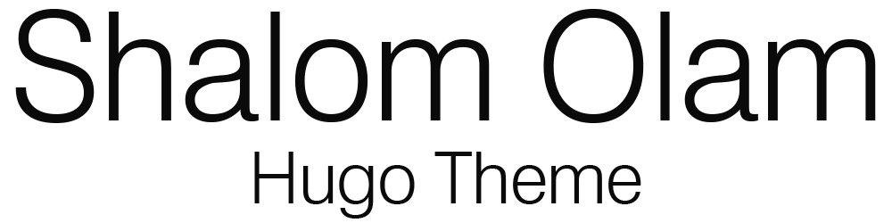

<p align="center">
    
    
</p>

# About

Shalom Olam is the first Hugo theme built for Hebrew blogs.

## Why Shalom Olam?

### Native Right To Left

The theme is built for Hebrew, and is styled for right to left text. It uses [Fomantic UI](https://fomantic-ui.com/) built in right to left mode to supply great looking components.

### Responsive Design

Easy to use on all screen sizes with no compromises. With a hamburger menu and search page for mobile screens and in-page search results for bigger screens users with all screen sizes can enjoy your blog.

### Search Engine Optimization

With full Schema.org tags on the entire theme and head tags the theme is built to create search engine friendly websites.

### Fuzzy Search

Your posts are easy to find thanks to built in fuzzy search. The theme uses [Fuse.js](https://fusejs.io/) to supply lightweight fuzzy search.

### Code Highlight

Code blocks are highlighted to be easier to read. The theme uses [Prism](https://prismjs.com/) to supply syntax highlight on back-ticked code blocks. It is configured for [some languages](#Highlight-Languages) and can be configured for other languages depending on your requirements.

### Old Browser Compatibility

All features of the theme work on IE11 alongside modern Chrome, Firefox and Edge. Guaranteeing users with older browsers have full access to your content.

### Screen Reader Friendly

The theme makes full use of screen reader attributes to make it easy for blind users to enjoy your content.

# Installation

This quick section should guide you though starting a new blog with this theme.

## Blog Setup

Create a new hugo blog and initialize a git repository at your blog's root directory:

    hugo new site .
    git init

Add all the files created into the repository:

    git add *
    git commit -m "Initial commit."

Make sure your blog builds fine by running the hugo dev server and going to `localhost:1313`:

    hugo serve

If your browser connects fine to the server you can continue to the next step.

## Theme Installation

The theme is split into a few repositories, the `shalom-olam-hugo-theme` is the one containing the theme itself. Add it as a git submodule to your hugo blog using the following command from the root of the blog:

    git submodule add https://github.com/LKummer/shalom-olam-hugo-theme.git shalom-olam

Set the theme in your blog config file, in this case `theme.toml`:

    theme = "shalom-olam"

Now your blog should be building using the Shalom Olam theme.

## Blog Preparation

The theme is built for specific section names that have their hardcoded functionality.

* `אודות` should contain a single `index.md` with `headless = true` that will be used to create the about section in the footer. If the section is not supplied the about section in the footer will not be built.
* `בלוג` should contain the blog, and shows a list section with a category list at the top.

To enable the search functionality, a search page is required. Create `~/content/חיפוש.md` and make sure it contains the following data in the front matter:

    ---
    layout: search
    outputs:
    - html
    - json
    ---

Now your blog should be fully functional.

# Notes

Things you should know when using the theme.

## Recommended Configuration

This is the recommended `config.toml` for building a blog using the theme.

    baseURL = "<url>"
    languageCode = "he-il"
    title = "<blog name>"

    theme = "shalom-olam"
    summaryLength = 20
    sectionPagesMenu = "main"

    paginate = 6

    [taxonomies]
        category = "categories"
        series = "series"

## Taxonomies

The theme is made to use with categories and series as taxonomies.

    [taxonomies]
        category = "categories"
        series = "series"

The `series` taxonomy is meant to be used with an array containing a single value.

    ---
    series:
    - שם הסדרה
    ---

## Highlight Languages

This theme uses `Prism.js` for syntax highlight. The theme is pre-configured to
support the following languages:

* `markup`, `html`, `xml`, `svg`, `mathml`.
* `css`.
* `clike`.
* `javascript`, `js`.
* `c`.
* `cpp`.
* `git`.
* `json`.
* `python`, `py`.
* `yaml`, `yml`.

They can be applied through back-ticked blocks:

    ```html
    <h1>Hello World</h1>
    ```

If you wish to use different languages you can replace the `prism.js` and
`prism.css` static files with ones that fit your requirements.

# License

This project is licensed under the GNU General Public License 3.0.

It is recommended to use a GPL version of Projucer for resaving the `.jucer`
project files in the repository.

## Used Dependencies:

Thanks to the developers of all the dependencies of this project.

* [Fomantic-UI](https://github.com/fomantic/fomantic-ui/) - MIT.
    * [jQuery](https://github.com/jquery/jquery) - MIT.
* [Fuse.js](https://github.com/krisk/fuse/) - Apache 2.0.
* [Prism.js](https://github.com/PrismJS/prism/) - MIT.
* [Core-js](https://github.com/zloirock/core-js) - MIT.

## Used Tools:

Thanks to the developers of all the tools used in this project.

* [Docker](https://www.docker.com/).
* [Webpack](https://github.com/webpack/webpack) - MIT.
* [Babel](https://github.com/babel/babel) - MIT.